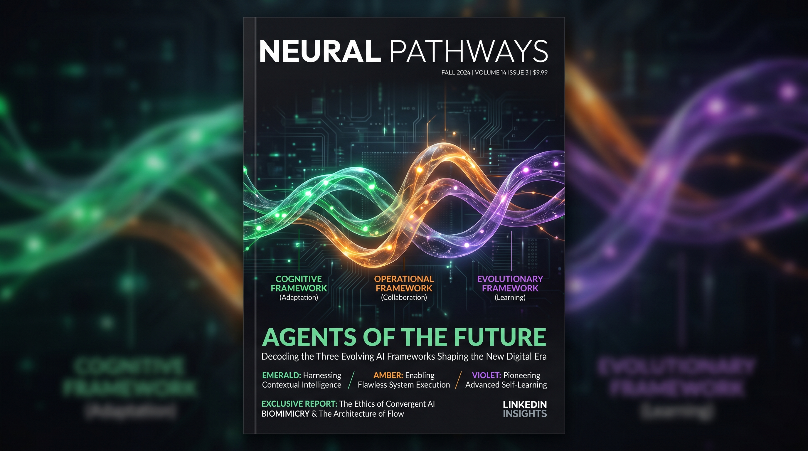

# hjLabs.in — AI Engineering Notes

Field notes from deploying production AI systems for enterprise teams. Written for CTOs, VPs of Engineering, and senior AI/ML engineers who have to ship systems that survive Monday morning, not just demo day.

All articles are based on real engagements. Technical depth is non-negotiable.

---

## 📚 Articles

### 1. [The 4 Mistakes That Kill 80% of Enterprise AI Projects](./01-four-mistakes-that-kill-enterprise-ai-projects.md)
Three years of auditing enterprise LLM deployments. Most don't fail because of the model — they fail because of four specific mistakes that show up across industries, team sizes, and budgets. Symptoms, root causes, and the fixes I recommend on audits.

**Tools / frameworks covered:** CrewAI, LangGraph, AutoGen, Ragas, DeepEval, Promptfoo, LangSmith, Langfuse, Arize Phoenix, NeMo Guardrails, Llama Guard, Presidio.

---

### 2. [Deploying Autonomous AI Agents in Production: A 2-Week Playbook](./02-deploying-autonomous-ai-agents-in-production-2-week-playbook.md)
Most teams quote 3-6 months to deploy production AI agents. We've done it in 2 weeks. Repeatedly. The exact 14-day playbook — scoping, framework choice, PoC, RAG layer, evaluation harness, production hardening.

**Technical depth:** JSON Schema strict mode, Qdrant binary quantization, Cohere Rerank 3, query rewriting, tiered model fallbacks, circuit breakers, prompt caching.

---

### 3. [How CibrAI Automated 80% of Their Security Analyst Workflow With Agentic AI](./03-cibrai-case-study-80-percent-security-workflow-automation.md)
A case study on building pragmatic agent systems for cybersecurity operations. How a two-phase agentic AI build freed a security team from tier-1 triage drudgery without replacing anyone.

**Architecture:** Agent loop, SIEM tool integration, RAG over runbooks, human-in-the-loop escalation, observability feedback loop.

---

### 4. [CrewAI vs LangGraph vs AutoGen: Which Framework for Production AI Agents?](./04-crewai-vs-langgraph-vs-autogen-production-comparison.md)
Honest comparison of the three leading agent frameworks based on production experience with all three. Strengths, weaknesses, ideal use cases, and a decision matrix for production criteria.

**Covers:** checkpointing, human-in-the-loop primitives, streaming, deterministic reducers, testability, cost control, observability.

---

### 5. [The Enterprise AI Buyer's Checklist: 12 Questions to Ask Before Hiring an AI Consultancy](./05-enterprise-ai-buyers-checklist-12-questions.md)
Four groups of three questions: Delivery Proof, Technical Depth, Engineering Practices, Business Fit. Each question includes why it matters, green-flag answer, red-flag answer.

**Designed for:** procurement leaders, CTOs, VPs of Engineering evaluating AI consultancies.

---

## 🛠 Services

These notes are written by the team at [hjLabs.in](https://hjlabs.in/) — an AI/ML consultancy building production agentic systems for enterprises.

- **[Agentic AI Development](https://hjlabs.in/AIML/services/agentic-ai/)** — autonomous agents for enterprise workflows
- **[RAG Systems](https://hjlabs.in/AIML/services/rag-systems/)** — production retrieval-augmented generation with reranking and evaluation
- **[LLM Fine-Tuning](https://hjlabs.in/AIML/services/llm-finetuning/)** — custom model training for domain-specific use cases
- **[MLOps](https://hjlabs.in/AIML/services/mlops/)** — deployment, monitoring, and lifecycle management

See our [case studies](https://hjlabs.in/AIML/case-studies.html) for more engagement details.

---

## 📅 Work With Us

If you're mid-deployment on an AI initiative and any of these articles resonated, **book a 30-minute strategy call** — no pitch deck, just a conversation about whether the approach fits your team.

👉 **[cal.com/hemangjoshi37a](https://cal.com/hemangjoshi37a)**

Or explore our services at [hjlabs.in/AIML/](https://hjlabs.in/AIML/).

---

## 📄 License

Content is released under [CC BY 4.0](https://creativecommons.org/licenses/by/4.0/). You're welcome to share, adapt, and build on it — just credit the source.

Code snippets (if any) are MIT licensed.

---

## 👤 About

Maintained by [Hemang Joshi](https://www.linkedin.com/in/hemang-joshi-046746aa/), founder of [hjLabs.in](https://hjlabs.in/). Ten years shipping ML systems that have to survive in production.

Follow the cross-posts:
- [LinkedIn](https://www.linkedin.com/in/hemang-joshi-046746aa/)
- [Medium](https://medium.com/@hemangjoshi37a)
- [Dev.to](https://dev.to/hemangjoshi37a)
- [Hashnode](https://hjlabs.hashnode.dev)
